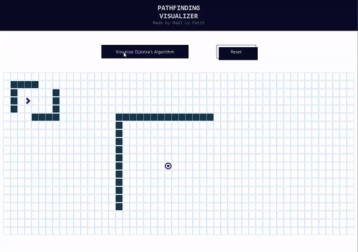

[![MIT License][license-shield]][license-url]
[![LinkedIn][linkedin-shield]][linkedin-url]

 

  <h3 align="center">Pathfinding Visualizer</h3>
  
 https://maelitop.github.io/pathfinding-visualizer/ 

<!-- TABLE OF CONTENTS -->

  
Table of Contents

  <ol>
    <li>
      <a href="#about-the-project">About The Project</a>
      <ul>
        <li><a href="#algo">Algorithms</a></li>
        <li><a href="#built-with">Built With</a></li>
      </ul>
    </li>
    <li><a href="#license">License</a></li>
    <li><a href="#contact">Contact</a></li>
    <li><a href="#references">References</a></li>
  </ol>

<!-- ABOUT THE PROJECT -->
## About The Project

  

**A web app to help visualizing typical graph searching algorithms**

### Built With

* [React.js](https://fr.reactjs.org/)

<!-- LICENSE -->
## License

Distributed under the MIT License. See `LICENSE` for more information.

<!-- CONTACT -->
## Contact

Maël LE PETIT - [@Maelito_P](https://twitter.com/Maelito_P) - contact@maelito.fr

Project Link: [https://github.com/MaelitoP/pathfinding-visualizer/](https://github.com/MaelitoP/pathfinding-visualizer/)

<!-- REFERENCES -->
## References
* [L-system](https://fr.wikipedia.org/wiki/L-Syst%C3%A8me)
* [P. Prusinkiewicz & A. Lindenmayer - The Algorithmic Beauty of Plants](http://algorithmicbotany.org/papers/abop/abop.pdf)
* [JSON](https://fr.wikipedia.org/wiki/JavaScript_Object_Notation)

<!-- MARKDOWN LINKS & IMAGES -->
[license-shield]: https://img.shields.io/github/license/othneildrew/Best-README-Template.svg?style=for-the-badge
[license-url]: https://github.com/MaelitoP/Lindenmayer/blob/main/LICENSE
[linkedin-shield]: https://img.shields.io/badge/-LinkedIn-black.svg?style=for-the-badge&logo=linkedin&colorB=555
[linkedin-url]: https://www.linkedin.com/in/maelitop/
[product-screenshot]: lindenmayer-tree.png
